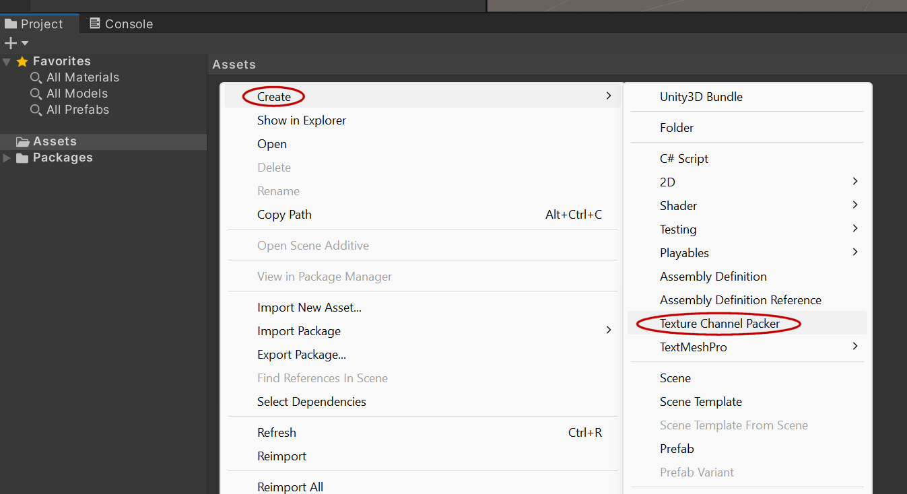
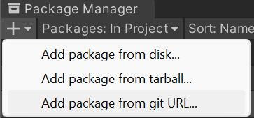
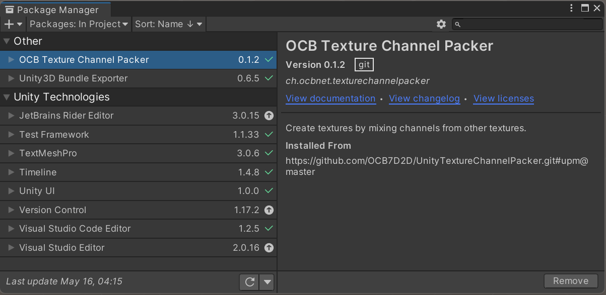
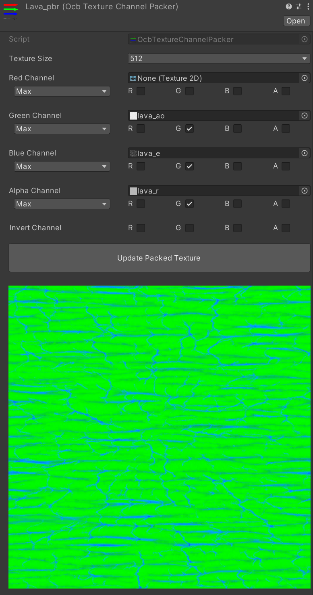
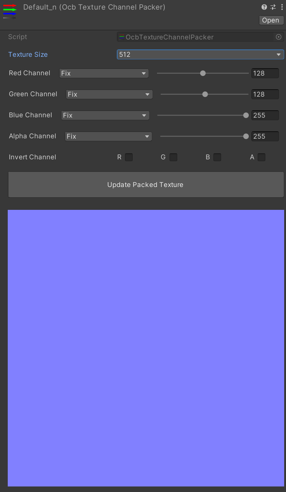

# Unity3D Texture Channel Packer Exporter

This package adds a new asset type to create texture from other
existing textures by mixing in different channels. It allows to create
packed Metallic/AO/Smoothness and any other kind of packed textures.



## Use in Unity

Use the following url to add it to unity via package manager:

https://github.com/OCB7D2D/UnityTextureChannelPacker.git#upm@master





### Use specific version

You may also use a specific version by specifying a release:

https://github.com/OCB7D2D/UnityTextureChannelPacker.git#upm@0.6.5

See https://github.com/OCB7D2D/UnityTextureChannelPacker/branches

### Add as dependency to your unity project

If you want to add this exporter as a dependency to your project,
you can either do that by using the package manager, or you could
also just edit/create `Packages/manifest.json` with the following:

```json
{
  "dependencies": {
    "ch.ocbnet.texturechannelpacker": "https://github.com/OCB7D2D/UnityTextureChannelPacker.git#upm@master",
  }
}
```

## Asset Configuration in Unity

Once you have created the asset in any folder, you can start to
configure it. You mainly need to select or drag&drop the source
textures you want to use the different channels from.

Once you hit the `Create/Update Packed Texture` button, a png
file with the same name as the asset will be created/updated.
Feel free to adjust the options for this new texture in the
texture importer options in unity, e.g. enable transparency.



To create a uniform normal texture, you may use this config:


